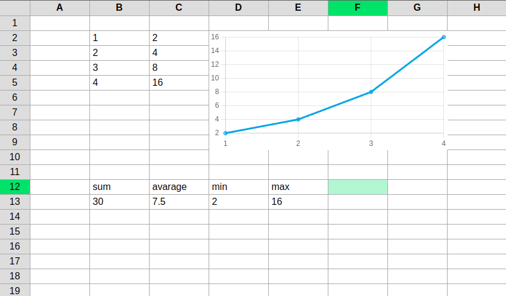
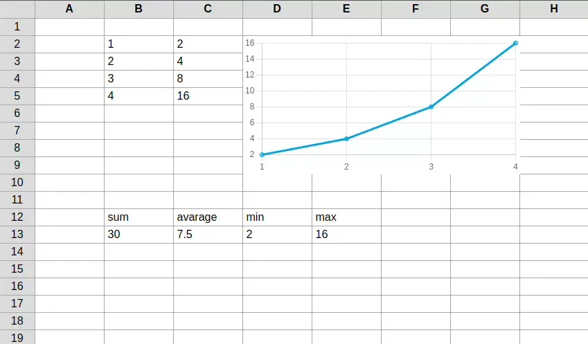

<p align="center">
    
</p>

# sheet-js

A browser based spreadsheet application, written with React and chart.js. It includes a main `Spreadsheet` React component, where you can specify the size of the spreadsheet and the initial data. Cell data is stored in a sparse structure, allowing for quick and memory efficient storage.



## Features

-   Keyboard based navigation
-   Selecting, copying, pasting and deleting cells
-   Storing numbers and strings
-   Formulas calculated based on multiple cells. They autoupdate when corresponding cells update.
-   Creating charts based on cells. Charts animate to accommodate changes to the data.



## Controls

-   `left click` - select a cell, when clicking a selected cell, will begin editing the cell text. Clicking with `shift` pressed will select a range of cells.
-   `arrow keys` - move the selection around. Moving with `shift` pressed will select cells.
-   `enter` - when editing a cell, confirms the changes and moves one cell downwards.
-   `escape` - deselects everything
-   `delete` - removes data in selected cells
-   `ctrl+g` - creates a chart based on the selected cells. You need to select two columns. Data from the first column will be used as the x values, and data in the second column will be used as the y values.
-   `ctrl + c` - copy selected cells.
-   `ctrl + v` - paste selected cells.

## Formulas

To begin a formula type `=` into a cell. The format for a formula expression is the following:

```
=funcName(A1:B2)
```

where `A1` and `B2` are two coordinates specifying the area, and `funcName` is a built-in function.

### Functions

> NOTE: Functions expecting numbers will ignore strings and empty cells.

-   `sum` - sum all numbers in an area.
-   `avg` - get the arithmetic average of numbers in an area.
-   `min` - get the smallest number in an area.
-   `max` - get the largest number in an area.
